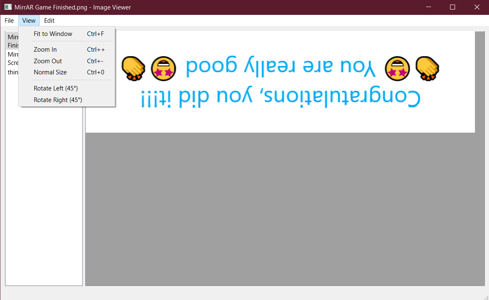
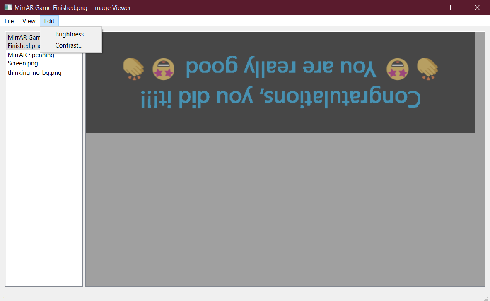
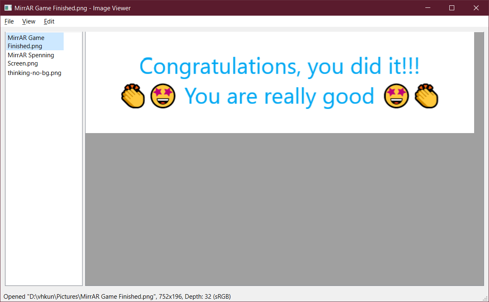

# QtImageViewer

Visualizing files with Qt.

Supported image formats: BMP, PNG, JPEG/JPG. Default: JPEG.

# What is available

1. Basic image visualization: Fit to window, zoom, panning, and rotation.

2. Basic image edit: brightness and contrast.

3. Open multiple files.

# How to run
Start by loading one or more images (File > Open...). Use the Menu to control the image visualization and access specific functions.

Next will be discussed platform specirics to run the application.

## Windows
Just run the file "ReadingImagesQt.exe" at the "releaseApp" directory to test it!

## Building or other platforms
### Prerequisites

* Qt must be installed and configured (including setting the environment variables). Instructions are available at: https://doc.qt.io/qt-5/gettingstarted.html
* CMake. Installation instructions are available at: https://cmake.org/install/

### Building
* Build normaly with CMake (by terminal, Visual Studio or CMake-gui).

# Future steps
* __Polish the interface__: Because the app was initially planed to be done using only Qt from C++, using ".qml" was made very difficult. In next steps we plan to assess the usage of qml files to make better UI.
